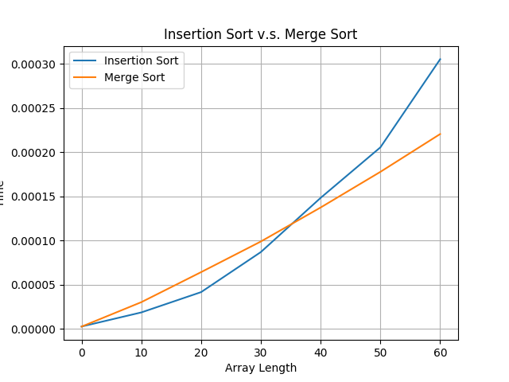

# Assignment 1

`Name`: Bo Lin, `Student ID`: 1001778270

## Insertion Sort v.s. Merge Sort

### Code

```python
import copy
import random
from time import time
import matplotlib
matplotlib.use('agg')
import matplotlib.pyplot as plt

def insertion_sort(array):
    for i in range(1, len(array)):
        p_insert = i
        while p_insert > 0 and array[p_insert - 1] > array[p_insert]:
            array[p_insert -
                  1], array[p_insert] = array[p_insert], array[p_insert - 1]
            p_insert -= 1
    return array

def merge_sort(array):

    def merge(sorted_array1, sorted_array2):
        sorted_array = []
        while sorted_array1 and sorted_array2:
            if sorted_array1[0] < sorted_array2[0]:
                sorted_array.append(sorted_array1.pop(0))
            else:
                sorted_array.append(sorted_array2.pop(0))
        return sorted_array + sorted_array1 + sorted_array2

    if len(array) <= 1:
        return array
    p_mid = len(array) // 2
    return merge(merge_sort(array[:p_mid]), merge_sort(array[p_mid:]))

def get_test_data(length, min_value=0, max_value=100):
    return [random.randint(min_value, max_value) for i in range(length)]

def test_sort_time(sort_func, array, repeat_times=1):
    start = time()
    for _ in range(repeat_times):
        array_copy = copy.deepcopy(array)
        sort_func(array_copy)
    end = time()
    return (end - start) / repeat_times


if __name__ == "__main__":
    repeat_times = 100
    array_length = []
    insertion_sort_times = []
    merge_sort_times = []
    for length in range(0, 61, 10):
        array_length.append(length)
        test_data = get_test_data(length)
        merge_sort_times.append(
            test_sort_time(merge_sort, test_data, repeat_times))
        insertion_sort_times.append(
            test_sort_time(insertion_sort, test_data, repeat_times))
    fig, ax = plt.subplots()
    insertion_sort_plot = ax.plot(
        array_length,
        insertion_sort_times,
        label='Insertion Sort',
    )
    merge_sort_plot = ax.plot(
        array_length,
        merge_sort_times,
        label='Merge Sort',
    )
    ax.set(
        xlabel='Array Length',
        ylabel='Time',
        title="Insertion Sort v.s. Merge Sort",
    )
    ax.grid()
    ax.legend()
    fig.savefig("result.png", dpi=100)
```

### Result



### Discussion

Although the time complexity of insertion sort and merge sort is $\Theta(n^2)$ and $\Theta(n\lg(n))$. When unsorted array is small, insertion sort takes less time than the merge sort, but when unsorted array is large, insertion sort is more time-consuming

## Insertion sort on small arrays in merge sort

### a

If the length of each sublist is $k$, the worst-case time complexity of insertion sort is $\Theta(k^2)$. So Sorting $\frac{n}{k}$ sublists takes $\Theta(k^2 \times \frac{n}{k}) = \Theta(nk)$.

### b

For the merge step, there are $\frac{n}{k}$ sorted sublists and merging them into a list need $\lg(\frac{n}{k})$ steps. For the sort step, there are $\frac{n}{k} \times k = n$ elements need to be compared. So the worst-case time is $\Theta(n\lg(\frac{n}{k}))$.

### c

To make 

$\Theta(nk + n\lg(\frac{n}{k})) = \Theta(n\lg(n))$

So

$\Theta(nk + n\lg(\frac{n}{k})) = \Theta(nk + n(\lg(n) - \lg(k)))$

$\Theta(nk + n\lg(\frac{n}{k})) = \Theta(nk + n\lg(n) - n\lg(k))$

Let $k = \lg(n)$

$\Theta(nk + n\lg(\frac{n}{k})) = \Theta(n\lg(n) + n\lg(n) - n\lg(\lg(n)))$

$\Theta(nk + n\lg(\frac{n}{k})) = \Theta(2n\lg(n) - n\lg(\lg(n)))$

$\Theta(nk + n\lg(\frac{n}{k})) = \Theta(n\lg(n))$

So assume k = $\lg(n)$ can make $\Theta(nk + n\lg(\frac{n}{k})) = \Theta(\lg(n))$.

### d

$k$ is the length of array on which insertion sort and merge sort take same time
