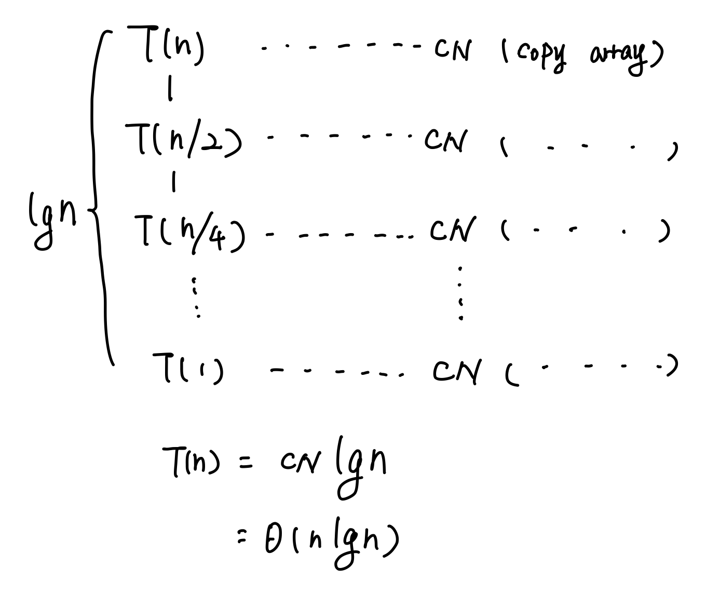
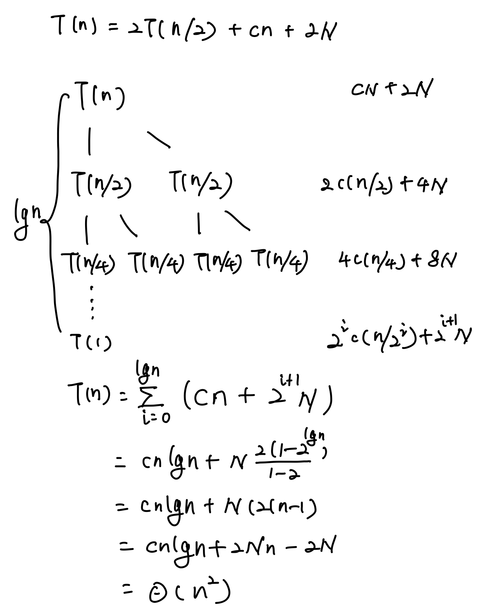
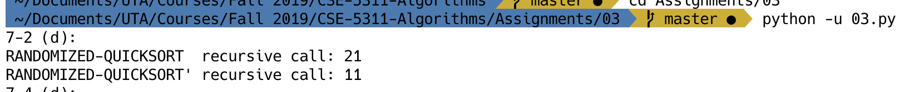
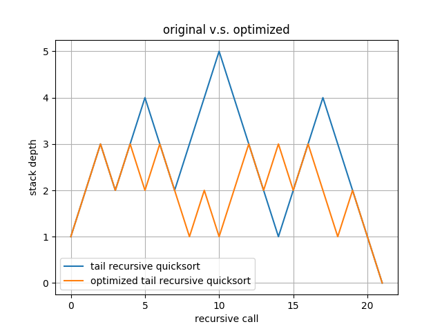

# <div style="text-align: center">CSE5311 Design and Analysis of Algorithms</div>

<div style="text-align: center">Name: Bo Lin</div>
<div style="text-align: center">Student ID: 1001778270</div>

## Problem 4-2 on Page 107

- **a.1**

binary search each iteration can reduce the problem size to half of the original

$T(n) = T(\frac{n}{2}) + c$

use master method, $a=1, b=2, n^{\log_{b}{a}}=n^0=1, f(n)=c=1$

because $n^{\log_{b}{a}}=f(n)$

$T(n) = \Theta(n^{\log_{b}^{a}}\lg{n}) = \Theta(\lg(n))$

- **a.2**



- **a.3**

$T(n) = T(\frac{n}{2}) + cn$

use master method, $a=1, b=2, n^{\log_{b}{a}}=n^0=1, f(n)=cn=n$

because $n^{\log_{b}{a}} \le f(n)$

$T(n) = \Theta(f(n)) = \Theta(n)$

- **b.1**

$T(n) = 2T(\frac{n}{2}) + cn$

use master method, $a=2, b=2, n^{\log_{b}{a}}=n^1=n, f(n)=cn=n$

because $n^{\log_{b}{a}} = f(n)$

$T(n) = \Theta(n^{\log_{b}{a}}\lg{n}) = \Theta(n\lg{n})$

- **b.2**



- **b.3**

need merge 2 subarray

$T(n) = 2T(\frac{n}{2}) + cn + 2\frac{n}{2}$

$T(n) = 2T(\frac{n}{2}) + (c + 1)n$

use master method, $a=2, b=2, n^{\log_{b}{a}}=n^1=n, f(n)=(c + 1)n=n$

because $n^{\log_{b}{a}} = f(n)$

$T(n) = \Theta(n^{\log_{b}{a}}\lg{n}) = \Theta(n\lg{n})$

## Problem 7-2 ( a ) ( b ) and ( c ) on Page 186

- **a.**

If all element values are equal, the program does not enter recursion, will traverses the array once when each element is pivot.

$T(n) = \Theta(n^2)$

- **b.**

```pseudocode
PARTITION'(A, p, r)
    x = A[r]
    i = p - 1
    k = 0
    for j = p to r - 1
        if A[j] <= x
            i = i + 1
            exchange A[i], A[j]
            if A[i] == x
                k = k + 1
            if A[i] < x
                exchange A[i - k], A[i]
    exchange A[i + 1], A[r]
    return i - k, i + 1
```

- **c.**

```pseudocode
RANDOMIZED-QUICKSORT'(A, p, r)
    if p < r
        q, t = PARTITION'(A, p, r)
        RANDOMIZED-QUICKSORT'(A, p, q - 1)
        RANDOMIZED-QUICKSORT'(A, t + 1, r)
```

```pseudocode
QUICKSORT'(A, p, r)
    if p < r
        q, t = RANDOMIZED-PARTITION'(A, p, r)
        QUICKSORT'(A, p, q - 1)
        QUICKSORT'(A, t + 1, r)
```

- **d.**

Console output:

```terminal
RANDOMIZED-QUICKSORT  recursive call: 21
RANDOMIZED-QUICKSORT' recursive call: 11
```



## Problem 7-4 on Page 188

- **a.**

TAIL-RECURSIVE-QUICKSORT still use the thought of divide and conquer.
QUICK has already proved can sort array A, TAIL-RECURSIVE-QUICKSORT can also sort array A,
because, in the while loop, the subarray split into two parts,
one was executed TAIL-RECURSIVE-QUICKSORT and another one split into two parts until p = r,
so TAIL-RECURSIVE-QUICKSORT can sort array A

- **b.**

If input array is already sorted, so the length of right subarray is always 0, and stack depth is n,
so stack depth is $\Theta(n)$

- **c.**

```pseudocode
TAIL-RECURSIVE-QUICKSORT'(A, p, r)
    while p < r
        q = PARTITION(A, p, r)
        if q < floor((r - p) / 2)
            TAIL-RECURSIVE-QUICKSORT'(A, p, q - 1)
            p = q + 1
        else
            TAIL-RECURSIVE-QUICKSORT'(A, q + 1, r)
            r = q - 1
```

- **d.**


