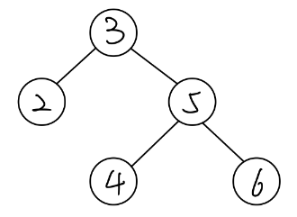
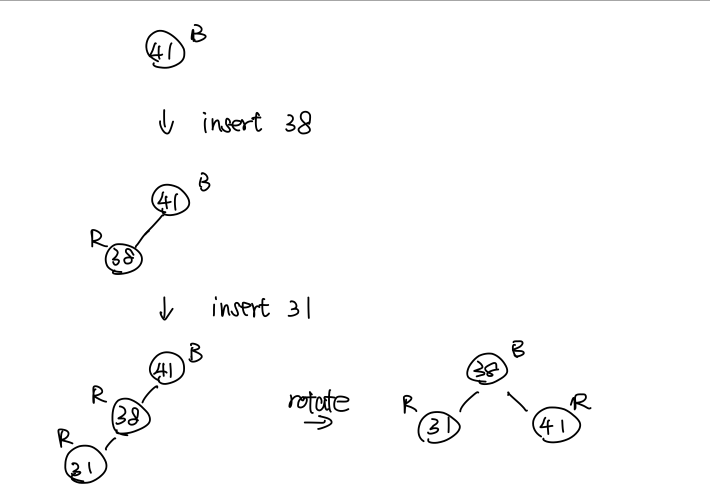
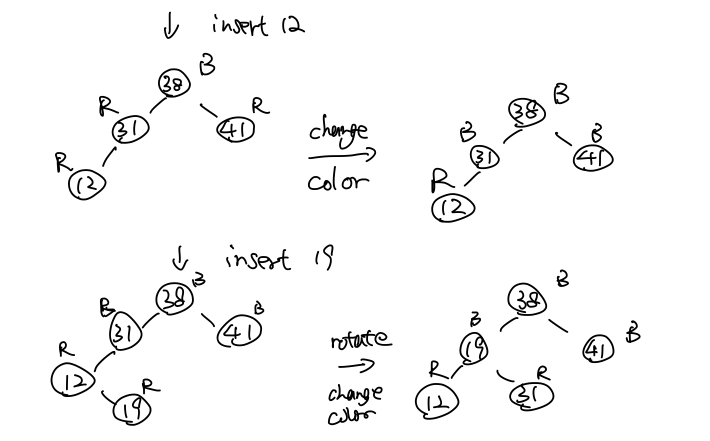
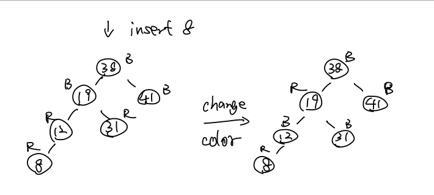

# <div style="text-align: center">CSE5311 Design and Analysis of Algorithms</div>

<div style="text-align: center">Name: Bo Lin</div>
<div style="text-align: center">Student ID: 1001778270</div>

## Exercise 12.2-3 on Page 293

The procedure TREE-PREDECESSOR, which is symmetric to TREE-SUCCESSOR. So

```pseudocode
TREE-PREDECESSOR(x):
    if x.left != NIL:
        return TREE-MAXIMUM(x.left)
    y = x.p
    while y!= NIL and x == y.left:
        x = y
        y = y.p
    return y
```

## Exercise 12.2-4 on Page 293



If we search 6 in this tree, A = {2, 4}, B = {3, 5, 6}, C = $\emptyset$, and 3 in B smaller than 4 in A.

So, any three keys a $\in$ A, b $\in$ B, and c $\in$ C satisfy a $\le$ b $\le$ c is false.

## Exercise 12.3-1 on Page 299

```pseudocode
# recursive version
TREE-INSERT(x, y, z):
    if y != NIL:
        if z.key < y.key:
            TREE-INSERT(y, y.left, z)
        else:
            TREE-INSERT(y, y.right, z)
    z.p = x
    if x == NIL:
        T.root = z
    else if z.key < x.key:
        x.left = z
    elsey
        x.right = z
```

## Problem 12 -1 on Page 303

```pseudocode
TREE-INSERT(T, z):
1   y = NIL
2   x = T.root
3   while x != NIL:
4       y = x
5       if z.key < x.key:
6           x = x.left
7       else:
8           x = x.right
9   z.p = y
10  if y == NIL:
11      T.root = z
12  elif z.key < y.key:
13      y.left = z
14  else:
15  y.right = z
```

**a.**
Insert $n$ items with identical keys using $\text{TREE-INSERT}$.
Line 5 and line 12 will always evaluate to false and the key will insert into right subtrees.
This tree will be a linked list, so the runtime will be $O(n)$.
The runtime of insert $n$ items will be $O(n^2)$

**b.**
One will be inserted into the left subtrees and the next one will be inserted into the right subtrees.
The difference in size between left subtrees and right subtrees at most one.
So the level of this BST is $\lg(n)$ and the runtime will be $O(\lg(n))$.
The runtime of insert $n$ items will be $O(n\lg(n))$

**c.**
The runtime of using a linked list for identical keys is $O(1)$.
So The runtime of insert $n$ items will be $O(n)$.
But the worst-case it doesn't matter with identical keys and is related to the order of insertion.
The runtime of insert $n$ items will be $O(n^2)$

**d.**
If the probability of selecting the left and right subtrees is the same, then it is similar to the case of B.
If not, insert an item is $O(n)$ and he runtime of insert $n$ items will be $O(n^2)$

## Exercise 13.3-2 on Page 322




