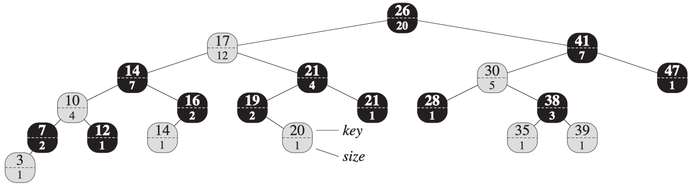

# <div style="text-align: center">CSE5311 Design and Analysis of Algorithms</div>

<div style="text-align: center">Name: Bo Lin</div>
<div style="text-align: center">Student ID: 1001778270</div>

## Exercise 14.1-1 on Page 344



```pseudocode
OS-SELECT(x,i)
1   r = x.left.size + 1
2   if i == r
3       return x
4   elseif i < r
5       return OS-SELECT(x.left, i)
6   else return OS-SELECT(x.right, i - r)
```

OS-SELECT(T.root, 10) means that return the 10th smallest element in the red-black tree T.
typora

- Pointer x goes to node 26, r = x.left.size + 1 = 12 + 1 = 13

    10 < r = 13, so run OS-SELECT on x's left subtree OS-SELECT(x.left, 10)

- Pointer x goes to node 17, r = x.left.size + 1 = 7 + 1 = 8

    10 > r = 8, so run OS-SELECT on x's right subtree OS-SELECT(x.right, 2)

- Pointer x goes to node 21, r = x.left.size + 1 = 2 + 1 = 3

    2 < r = 3, so run OS-SELECT on x' left subtree OS-SELECT(x.left, 2)

- Pointer x goes to node 19, r = x.left.size(NIL.size = 0) + 1 = 0 + 1 = 1

    2 > r = 1, so run OS-SELECT on x's right subtree OS-SELECT(x.right, 1)

- Pointer x gors to node 20, r = x.left.size(NIL.size = 0) + 1 = 0 + 1 = 1

    1 = r = 1, so return x, node 20 is 10th smallest element in the red-black tree T.

## Exercise 14.1-2 on Page 344


```pseudocode
OS-RANK(T, x)
1   r = x.left.size + 1
2   y = x
3   while y != T.root
4       if y == y.p.right
5           r = r + y.p.left.size + 1
6       y = y.p
7   return r
```

OS-RANK(T, 35) means that return the rank of node 35 in the red-black tree T

r = x.left.size + 1 = 0 + 1 = 1, pointer y goes to x, node 35.

- y is not the root of red-black tree T, so in the while loop

    y is not the right child of its parent, r = 1

    pointer y goes to its parent node 38

- y is not the root of red-black tree T, so in the while loop

    y is the right child of its parent, r = r + y.p.left.size + 1 = 1 + 1 + 1 = 3

    pointer y goes to its parent node 30

- y is not the root of red-black tree T, so in the while loop

    y is not the right child of its parent, r = 3

    pointer y goes to its parent node 41

- y is not the root of red-black tree T, so in the while loop

    y is the right child of its parent, r = r + y.p.left.size + 1 = 3 + 12 + 1 = 16

    pointer y goes to its parent node 26

- y is the root of red-black tree T, so node 35 is th 16th smallest element in the red-black tree T

## Exercise 14.1-5 on Page 344

We can first run OS-RANK(T, x) to find out x's rank $r$ of this red-black tree T
and then run OS-SELECT(T, r + i) to find out the ith successor of x.

The runtime of OS-RANK(T, x) and OS-SELECT(T, r + i) both are $O(\lg{n})$ and the total runtime is $O(\lg{n})$

## Exercise 14.3-3 on Page 353

```pseudocode
SEARCH-INTERVAL(x, i)
    if x.left != NIL and x.left.max >= i.low
        y = SEARCH-INTERVAL(x.left, i)
        if y != NIL
            return y
        else return y
        elif OVERLAP(x, i)
            return x
        else return NIL
    elif OVERLAP(x, i)
        return x
    else return SEARCH-INTERVAL(x.right, i)

OVERLAP(x, i)
    if x.high < i.low || i.high < x.low
        return false
    else return true
```
